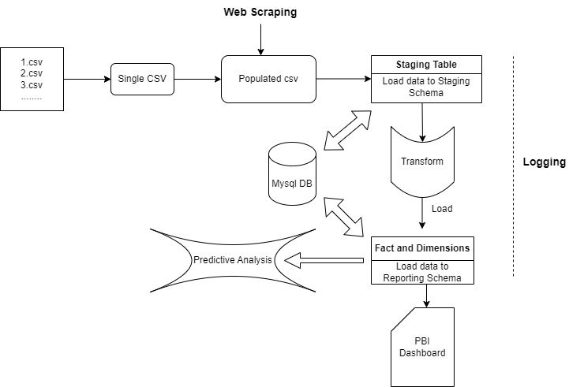
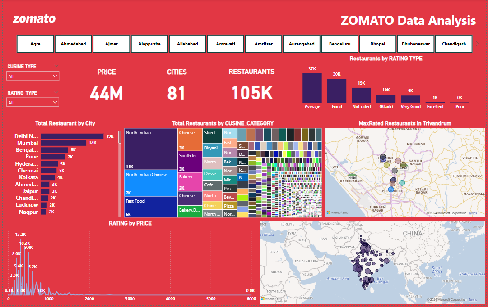

# Zomato Dataset ETL and Predictive Analysis

## Introduction

This repository contains the code and documentation for performing Extract, Transform, Load (ETL) processes and predictive analysis on the Zomato dataset. The dataset consists of restaurant information collected from various sources and enriched with additional data such as latitude and longitude.

## Project Structure

- **Data**: Contains the raw and processed datasets.
- **merge_csv.py**: Combines all the datasets in different directories into a single one.
- **Notebooks & Web scraping files**:
  - **scraping.ipynb**: Web scraping using Beautiful soup to enrich the data using extra features like Latitude and Longitude
    - **data_enrichment.py**: If the dataset is small, go for this method and if dataset is big it will take a large time to scrap each datapoint.
    - **data_enrichment_parallel2.py**: For larger dataset this method is adopted but chance of missing values in the scraped column increases.
  - **staging.ipynb**: Combines and cleans the raw data, performs data quality checks, and loads it into a staging table in MySQL.
  - **Transform_Load&EDA.ipynb**: Transforms the data, performs exploratory data analysis (EDA), creates reporting tables in MySQL, and loads the fact and dimension tables into PowerBI for dashboard creation.
  - **predictive_analysis.ipynb**: Conducts predictive analysis on the dataset, including feature selection, preprocessing, model training (Linear Regression, Decision Tree Regression, Random Forest Regression), evaluation, and selection of the final model.

- **Modular code**:
  - **etl_pipeline.py**: Run this file for the full streamlined processing of ETL pipeline.
  - **extract.py**:Extract the data from flat files and API's.
  - **staging.py**:Load the extracted data into staging area in Mysql database.
  - **Transform.py**:Perform essential Data transformations and create the star schema required for loading the data.
  - **Load.py**:- Load the data into the Mysql database for further analysis using PowerBI and predictive modeling.

## Workflow

1. **Data Collection**: Raw data is collected from various sources and combined into one dataset.
2. **Staging**: The raw dataset is cleaned, checked for quality, and loaded into a staging table in MySQL.
3. **Transformation**: Data is transformed, and EDA is performed to derive insights. Reporting tables are created in MySQL, and the dataset is divided into fact and dimension tables using a star schema approach.
4. **Loading**: Fact and dimension tables are loaded into PowerBI to create a dashboard for analysis.
5. **Predictive Analysis**: Features are selected, and preprocessing is performed on the dataset. Three regression models are trained, evaluated, and compared to select the final model.

## Conclusion

- The ETL process ensures clean and structured data for analysis.
- EDA provides insights into the dataset, helping in decision-making.
- Predictive analysis helps in building a model for restaurant rating prediction, with Decision Tree Regression selected as the final model.

## Repository Structure

```
├── PBI_Dashboard/
│   ├── zomato.pbix
├── data/
│   ├── input/
│   ├── output/
├── Experiment/
│   ├── data_enrichment.py
│   ├── data_enrichment_parallel2.py
│   ├── merge_csv.py
│   ├── Scrapping.ipynb
│   ├── Staging.ipynb
│   ├── Transform_Load&EDA.ipynb
├── src/
│   └── __init__.py
│   └── etl_pipeline.py
│   ├── utils/
│       └── __init__.py
│       └── common_utils.py
│       └── etl.py
│       └── extract.py
│       └── Load.py
│       └── staging.py
│       └── Transform.py
│   └── training.py
│   ├── ML_utils/
│       └── __init__.py
│       └── data_loader.py
│       └── data_preprocessing.py
│       └── modeling.py
│   └── predictive_analysis.ipynb
├── ML_config.yml
├── config.yml
├── logs/
├── README.md
└── requirement.txt
└── setup.py
└── Workflow_Architecture.png
```

## Workflow Architecture



## PowerBI Analysis



Please refer to the individual notebooks for detailed code implementation and analysis.

For any questions or clarifications, feel free to contact [ARJUN] at [54721arjun@gmail.com].
